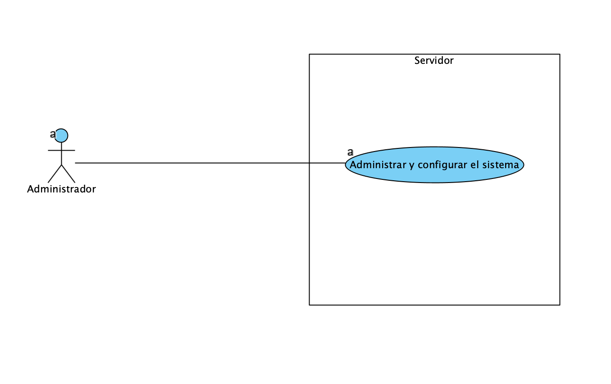
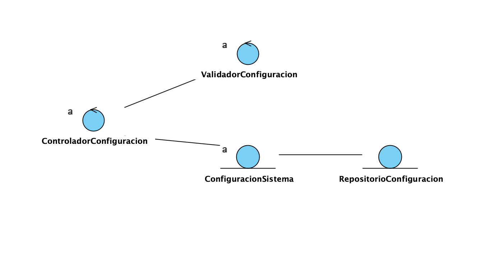

## 🧩 Grupo Funcional 7 — Lado Servidor

Este módulo contiene la documentación correspondiente al **lado servidor** del Grupo Funcional 7, incluyendo el **requisito funcional RF-16** y el **requisito no funcional RNF-10**, así como su análisis asociado.

El objetivo de este grupo funcional en el servidor es cubrir:

* **Gestión y configuración centralizada del sistema**.
* **Aplicación global de parámetros de funcionamiento**.
* **Interoperabilidad con otros servicios universitarios**.

---

## 📊 Diagrama de Casos de Uso (Servidor)

El siguiente diagrama representa la interacción entre los actores del lado servidor y los casos de uso asociados al requisito funcional **RF-16**.

---

## 📃 Resumen de Casos de Uso del Servidor

| ID        | Caso de Uso                       | Actor Principal | Descripción breve                                                              |
| --------- | --------------------------------- | --------------- | ------------------------------------------------------------------------------ |
| **CU-16** | Gestionar y configurar el sistema | Administrador   | Permite modificar y aplicar parámetros globales del sistema desde el servidor. |

---

## 📌 Descripción de Casos de Uso

A continuación se encuentra el caso de uso detallado que forma parte de este grupo funcional.
Incluye actores, precondiciones, postcondiciones, flujo normal, flujos alternativos y reglas de negocio.

---

### ⚙️ **CU-16 — Gestionar y configurar el sistema**

**Requisito asociado:** RF-16
**Actor principal:** Administrador del sistema

---

### **Descripción**

El servidor permite al administrador gestionar y configurar los parámetros generales del sistema, garantizando que los cambios realizados se almacenan de forma persistente y se aplican de manera global a todos los usuarios y servicios del sistema.

Los parámetros gestionados incluyen, entre otros:

* Políticas de préstamo
* Horarios de servicio
* Sanciones y penalizaciones
* Límites y restricciones generales

---

### **Precondiciones**

* El administrador ha iniciado sesión correctamente.
* El administrador dispone de permisos de configuración avanzada.
* El servidor se encuentra operativo.

---

### **Postcondiciones**

* La nueva configuración queda almacenada en el sistema.
* Los cambios se aplican de forma global.
* El sistema queda actualizado con los nuevos parámetros.

---

### **Flujo principal**

1. El servidor recibe la solicitud de configuración desde el cliente.
2. El sistema valida los permisos del administrador.
3. El servidor valida los valores recibidos.
4. La configuración se almacena de forma persistente.
5. El sistema aplica los cambios globalmente.
6. El servidor devuelve confirmación al cliente.

---

### **Flujos alternativos**

* Los valores recibidos no cumplen las restricciones definidas.
* El administrador no tiene permisos suficientes.
* Error al almacenar la configuración.
* Error de comunicación con sistemas externos.

---

### **Reglas de negocio**

* Solo los administradores pueden modificar la configuración del sistema.
* Los valores deben cumplir las políticas definidas por la institución.
* Los cambios afectan a todos los módulos del sistema.
* Las configuraciones deben mantenerse consistentes con servicios externos.

---

## 🧠 2. Fase de Análisis — Diagrama de Análisis del Servidor

El siguiente diagrama representa la estructura lógica del servidor para el caso de uso **CU-16**, mostrando los componentes encargados de validar, almacenar y aplicar la configuración del sistema.

---

## 📌 Consideración del Requisito No Funcional RNF-10

### **RNF-10 — Interoperabilidad**

El servidor debe estar preparado para integrarse con otros servicios universitarios externos, tales como:

* Bases de datos académicas.
* Sistemas de gestión docente.
* Servicios de estadísticas institucionales.

Este requisito no funcional condiciona el diseño del servidor, garantizando:

* Uso de interfaces estándar.
* Comunicación mediante protocolos compatibles.
* Posibilidad de intercambio de datos con sistemas externos.

---

---

## 🏛️ Diagrama de Clases del Servidor — Grupo Funcional 7

El siguiente diagrama de clases representa el **diseño del lado servidor** para el caso de uso **CU-16 – Gestionar y configurar el sistema**, correspondiente al **Grupo Funcional 7**.

Este diseño refleja una arquitectura en **tres capas**, separando claramente responsabilidades y facilitando el mantenimiento, la escalabilidad y la interoperabilidad con otros sistemas.

---

### 📷 Diagrama de Clases

---

## 📝 Explicación del Diseño

### **1️⃣ Capa de Presentación (`Presentacion.server`)**

**Clase incluida:**
- `UIConfiguracionSistema`

**Responsabilidad:**
- Recibir la solicitud del administrador desde la interfaz.
- Enviar los datos de configuración al controlador de dominio.
- Mostrar la confirmación o error devuelto por el servidor.

Esta capa no contiene lógica de negocio, actuando únicamente como intermediaria entre el cliente y el dominio.

---

### **2️⃣ Capa de Dominio (`Dominio.server`)**

**Clases incluidas:**
- `ControladorConfiguracion`
- `ValidarConfiguracion`
- `ConfiguracionSistema`

**Responsabilidad:**
- Orquestar el caso de uso CU-16.
- Validar los parámetros de configuración recibidos.
- Aplicar las reglas de negocio.
- Coordinar el acceso a la persistencia.

El controlador centraliza el flujo del caso de uso, mientras que la validación se desacopla en una clase específica para cumplir el principio de responsabilidad única.

---

### **3️⃣ Capa de Persistencia (`Persistencia.server`)**

**Clase incluida:**
- `RepositorioConfiguracion`

**Responsabilidad:**
- Almacenar de forma persistente la configuración del sistema.
- Recuperar la configuración actual cuando sea necesario.

Esta capa facilita la integración con otros servicios externos, cumpliendo el requisito no funcional **RNF-10 (Interoperabilidad)**.

---

## 🔁 Flujo resumido de ejecución

| Paso | Componente |
|-----|-----------|
| 1 | UIConfiguracionSistema |
| 2 | ControladorConfiguracion |
| 3 | ValidarConfiguracion |
| 4 | RepositorioConfiguracion |
| 5 | Respuesta al administrador |

---

## ✅ Resumen del Diseño

| Capa | Función principal | Clases |
|------|------------------|--------|
| Presentación | Recepción de solicitudes | `UIConfiguracionSistema` |
| Dominio | Lógica de negocio | `ControladorConfiguracion`, `ValidarConfiguracion`, `ConfiguracionSistema` |
| Persistencia | Acceso a datos | `RepositorioConfiguracion` |

---
