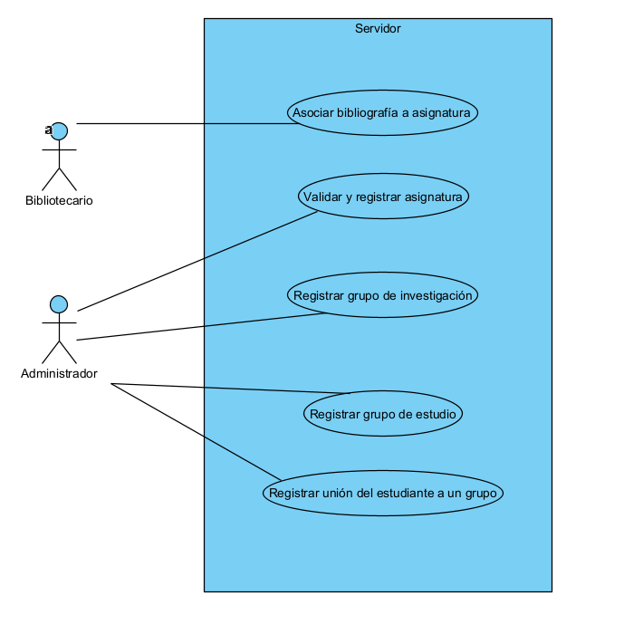
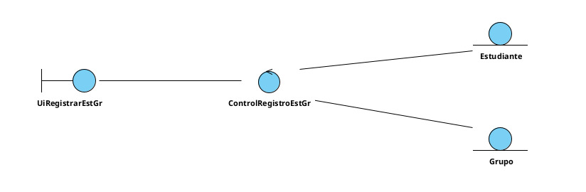
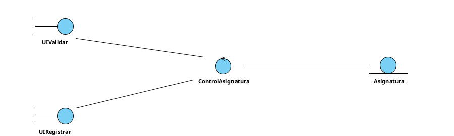
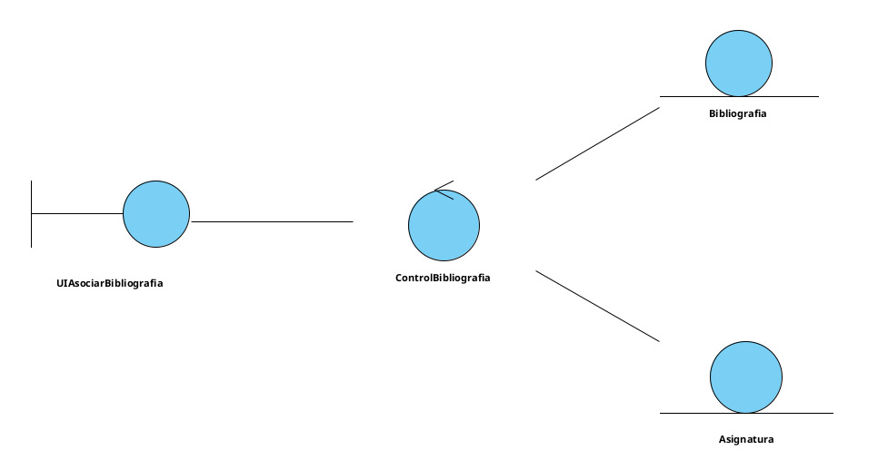
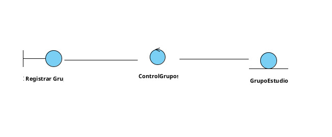
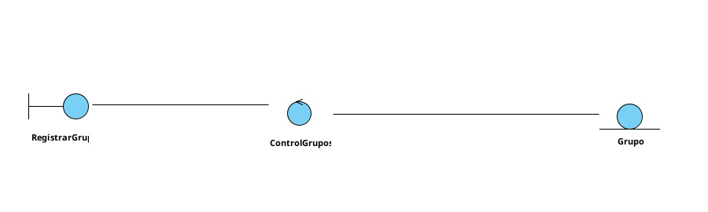
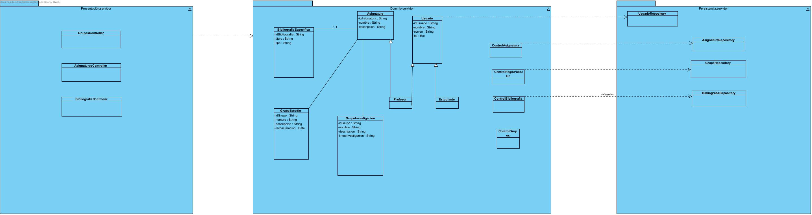

# ISOII-B05

# 🖧 Grupo Funcional 5 — Lado Servidor

Este directorio contiene toda la documentación relacionada con el **lado servidor** del Grupo Funcional 5.  
Aquí se describe cómo el backend del sistema gestiona, valida y almacena la información asociada a los procesos académicos y sociales del grupo funcional.

Mientras que el lado cliente permite que estudiantes y profesores interactúen con la interfaz, el **servidor** se encarga de realizar las operaciones internas: validaciones, control de roles, persistencia de datos y coordinación con los módulos del sistema.

---

## 📊 Diagrama de Casos de Uso del Servidor (GF5)

El siguiente diagrama muestra los casos de uso internos del servidor y los actores que interactúan con ellos (Bibliotecario y Administrador).

---

## 📃 Resumen de Casos de Uso del Servidor

| ID | Caso de Uso (Servidor) | Actor Principal | Descripción |
|----|-------------------------|-----------------|-------------|
| **SRV-06** | Registrar unión del estudiante a un grupo | Sistema | Procesa la solicitud de un estudiante para unirse a un grupo y la almacena. |
| **SRV-07** | Validar y registrar asignatura | Sistema / Administrador | Valida los datos introducidos por el profesor y registra la asignatura. |
| **SRV-08** | Asociar bibliografía a asignatura | Sistema / Bibliotecario | Valida y registra los recursos bibliográficos asociados a una asignatura. |
| **SRV-09** | Registrar grupo de estudio | Sistema / Administrador | Crea y registra un nuevo grupo de estudio asociado a una asignatura. |
| **SRV-10** | Registrar grupo de investigación | Sistema / Administrador | Valida y registra un grupo de investigación creado por un profesor. |

---

# 📌 Casos de Uso Detallados del Servidor

A continuación se detallan los casos de uso internos que ejecuta el backend cuando los actores del cliente realizan acciones en la interfaz.

---

## 🔹 **SRV-06 — Registrar unión del estudiante a un grupo**  
**Requisito asociado:** RF-06  
**Actor principal:** Sistema  
**Actores secundarios:** Administrador (si gestiona restricciones)

### Descripción  
El servidor valida y registra la unión de un estudiante a un grupo de estudio o club de lectura.

### Precondiciones  
- El estudiante existe y ha iniciado sesión.  
- El grupo existe y está activo.

### Postcondiciones  
- El estudiante queda registrado como miembro del grupo en la base de datos.

### Flujo principal  
1. El servidor recibe la solicitud del cliente.  
2. Comprueba que el grupo existe.  
3. Verifica que el estudiante tiene permisos y no pertenece ya al grupo.  
4. Registra la unión en la base de datos.  
5. Envía confirmación al cliente.

### Flujos alternativos  
- El estudiante ya forma parte del grupo.  
- El grupo está lleno.  
- El grupo requiere aprobación previa.

---

## 🔹 **SRV-07 — Validar y registrar asignatura**  
**Requisito asociado:** RF-07  
**Actor principal:** Administrador / Sistema

### Descripción  
El servidor valida los datos introducidos por un profesor y registra la asignatura.

### Precondiciones  
- El profesor es válido y tiene permisos.  
- El código de la asignatura no existe.

### Postcondiciones  
- La asignatura queda registrada en la base de datos.

### Flujo principal  
1. El servidor recibe la creación de asignatura.  
2. Comprueba unicidad del código.  
3. Valida los campos y el rol del profesor.  
4. Guarda la asignatura.  
5. Confirma la operación al cliente.

### Alternativos  
- Código duplicado.  
- Falta información obligatoria.

---

## 🔹 **SRV-08 — Asociar bibliografía a asignatura**  
**Requisito asociado:** RF-08  
**Actor principal:** Bibliotecario / Sistema

### Descripción  
Procesa la asociación de recursos bibliográficos a una asignatura.

### Precondiciones  
- La asignatura existe.  
- El recurso existe en el catálogo.

### Postcondiciones  
- El recurso queda asociado a la asignatura.

### Flujo principal  
1. El servidor recibe la solicitud.  
2. Verifica que el recurso existe.  
3. Comprueba permisos del profesor o bibliotecario.  
4. Registra la asociación en la BD.  
5. Envía confirmación.

### Alternativos  
- El recurso no existe.  
- No se tienen permisos.

---

## 🔹 **SRV-09 — Registrar grupo de estudio**  
**Requisito asociado:** RF-09  
**Actor principal:** Administrador / Sistema

### Descripción  
Crea y almacena un nuevo grupo de estudio vinculado a una asignatura.

### Precondiciones  
- La asignatura existe.  
- El profesor está autorizado.

### Postcondiciones  
- El grupo queda registrado en el sistema.

### Flujo principal  
1. El servidor recibe los datos del grupo.  
2. Verifica la asignatura asociada.  
3. Valida permisos.  
4. Registra el grupo.  
5. Devuelve confirmación.

### Alternativos  
- Nombre duplicado.  
- Asignatura inexistente.

---

## 🔹 **SRV-10 — Registrar grupo de investigación**  
**Requisito asociado:** RF-10  
**Actor principal:** Administrador / Sistema

### Descripción  
Registra un grupo de investigación introducido por un profesor.

### Precondiciones  
- El profesor pertenece a un departamento autorizado.  
- El grupo no existe previamente.

### Postcondiciones  
- El grupo queda registrado.

### Flujo principal  
1. El servidor recibe la solicitud.  
2. Comprueba nombre único.  
3. Valida departamento del profesor.  
4. Registra el grupo.  
5. Envía confirmación.

### Alternativos  
- Nombre duplicado.  
- Profesor sin permisos.

---

# 🧠 **Fase de Análisis (Servidor)**

En esta fase se estudian los comportamientos, reglas de negocio y responsabilidades que asumirá el servidor para cumplir los requisitos. Se describen las entidades principales, las validaciones críticas y las interacciones internas necesarias para garantizar coherencia y seguridad en el backend.

### 🔍 Elementos analizados

#### ✔ **Actores internos del servidor**

* **Sistema**: ejecuta validaciones automáticas, gestiona procesos internos y coordina operaciones.
* **Administrador**: puede crear y validar asignaturas, grupos de estudio e investigación.
* **Bibliotecario**: gestiona la bibliografía asociada a las asignaturas.

#### ✔ **Entidades principales**

* **Estudiante**
* **Profesor**
* **Asignatura**
* **Grupo de estudio**
* **Grupo de investigación**
* **Recurso bibliográfico**

---

## 📃 Resumen de Casos de Uso del Servidor

| ID         | Caso de Uso (Servidor)                    | Actor Principal         | Descripción                                                                 |
| ---------- | ----------------------------------------- | ----------------------- | --------------------------------------------------------------------------- |
| **SRV-06** | Registrar unión del estudiante a un grupo | Sistema                 | Procesa la solicitud de un estudiante para unirse a un grupo y la almacena. |
| **SRV-07** | Validar y registrar asignatura            | Sistema / Administrador | Valida los datos introducidos por el profesor y registra la asignatura.     |
| **SRV-08** | Asociar bibliografía a asignatura         | Sistema / Bibliotecario | Valida y registra los recursos bibliográficos asociados a una asignatura.   |
| **SRV-09** | Registrar grupo de estudio                | Sistema / Administrador | Crea y registra un nuevo grupo de estudio asociado a una asignatura.        |
| **SRV-10** | Registrar grupo de investigación          | Sistema / Administrador | Valida y registra un grupo de investigación creado por un profesor.         |

---

# 📌 Casos de Uso Detallados del Servidor

A continuación se detallan los casos de uso internos que ejecuta el backend cuando los actores del cliente realizan acciones en la interfaz.

---

## Diagrama de Clases de Análisis (SRV-06)

## Diagrama de Clases de Análisis (SRV-07)

## Diagrama de Clases de Análisis (SRV-08)

## Diagrama de Clases de Análisis (SRV-09)

## Diagrama de Clases de Análisis (SRV-10)

# 🧩 Diagrama de Clases del Servidor (GF5)

El siguiente diagrama representa la *estructura interna del servidor* para el Grupo Funcional 5.
En él se definen las capas, las entidades principales, los controladores de dominio y los repositorios que permiten al backend gestionar asignaturas, bibliografía y grupos académicos.

El objetivo de esta fase es preparar la *arquitectura que será implementada en la siguiente iteración*, asegurando separación por capas, claridad en las responsabilidades y cumplimiento de los requisitos funcionales RF-06, RF-07, RF-08, RF-09 y RF-10.

---

## Estructura del Servidor por Capas

El servidor sigue una arquitectura en *tres capas*, donde cada una tiene un rol específico en la ejecución de los casos de uso.

---

## 🎨 1. Capa de Presentación (Presentation.server)

Contiene los controladores que reciben las solicitudes desde el cliente para:

* *AsignaturaController*
* *BibliografiaController*
* *GrupoController*

### Funciones principales:::::::::

* Recibir peticiones (crear grupo, asociar bibliografía, registrar asignatura…)
* Validar datos básicos
* Llamar a los controladores de dominio
* Devolver la respuesta al cliente

> Esta capa solo gestiona, *no lógica de negocio*.

---

## 🧠 2. Capa de Dominio (Domain.server)

Es el núcleo del sistema. Incluye las *entidades* y los *controladores de lógica de negocio* que implementan los casos de uso del servidor.

### ✔ Entidades modeladas

* *Asignatura*
* *BibliografiaEspecifica*
* *GrupoEstudio*
* *GrupoInvestigacion*
* *Usuario*, con roles diferenciados:

  * Profesor
  * Estudiante

Cada entidad representa información gestionada por los requisitos del GF5.

### ✔ Controladores de dominio

* *ControlAsignatura* (SRV-07)
* *ControlBibliografia* (SRV-08)
* *ControlGrupoEst* (SRV-09)
* *ControlGrupoInv* (SRV-10)
* *ControlRegistroEstGr* (SRV-06)

### Responsabilidades

* Validar reglas de negocio
* Verificar permisos según rol (profesor, administrador, bibliotecario)
* Comprobar unicidad, pertenencia y relaciones entre entidades

> Aquí se ejecuta toda la lógica interna del servidor.

---

## 🗃️ 3. Capa de Persistencia (Persistence.server)

Contiene los repositorios responsables de almacenar y recuperar datos:

* *AsignaturaRepository*
* *BibliografiaRepository*
* *GrupoRepository*
* *UsuarioRepository*

### Funciones:

* Consultas, inserciones y actualizaciones en la BD
* Proveer información al dominio
* Mantener encapsulada la lógica de persistencia

> El dominio nunca accede directamente a la base de datos: siempre pasa por los repositorios.

---

## 📌 Relación con los Casos de Uso del Servidor

Este diseño soporta los casos internos del GF5:

| Caso de Uso                                 | Controlador          | Entidades Relacionadas             |
| ------------------------------------------- | -------------------- | ---------------------------------- |
| *SRV-06* Registrar unión a grupo          | ControlRegistroEstGr | Estudiante, GrupoEstudio           |
| *SRV-07* Validar y registrar asignatura   | ControlAsignatura    | Asignatura, Profesor               |
| *SRV-08* Asociar bibliografía             | ControlBibliografia  | Asignatura, BibliografiaEspecifica |
| *SRV-09* Registrar grupo de estudio       | ControlGrupoEst      | GrupoEstudio, Asignatura           |
| *SRV-10* Registrar grupo de investigación | ControlGrupoInv      | GrupoInvestigacion, Profesor       |

---

# 🖼️ Diagrama de Clases del Servidor

---

# 🧪 *Fase de Testing*

En esta fase realizaremos tests unitarios al código implementado del servidor haciendo uso de junit.

