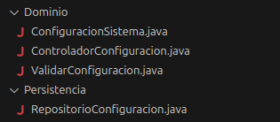

# ISOII-B05

# 🖧 Grupo Funcional 5 — Lado Servidor

Este directorio contiene toda la documentación relacionada con el **lado servidor** del Grupo Funcional 5.  
Aquí se describe cómo el backend del sistema gestiona, valida y almacena la información asociada a los procesos académicos y sociales del grupo funcional.

Mientras que el lado cliente permite que estudiantes y profesores interactúen con la interfaz, el **servidor** se encarga de realizar las operaciones internas: validaciones, control de roles, persistencia de datos y coordinación con los módulos del sistema.

---

## 📊 Diagrama de Casos de Uso del Servidor (GF5)

El siguiente diagrama muestra los casos de uso internos del servidor y los actores que interactúan con ellos (Bibliotecario y Administrador).

---

## 📃 Resumen de Casos de Uso del Servidor

| ID | Caso de Uso (Servidor) | Actor Principal | Descripción |
|----|-------------------------|-----------------|-------------|
| **SRV-06** | Registrar unión del estudiante a un grupo | Sistema | Procesa la solicitud de un estudiante para unirse a un grupo y la almacena. |
| **SRV-07** | Validar y registrar asignatura | Sistema / Administrador | Valida los datos introducidos por el profesor y registra la asignatura. |
| **SRV-08** | Asociar bibliografía a asignatura | Sistema / Bibliotecario | Valida y registra los recursos bibliográficos asociados a una asignatura. |
| **SRV-09** | Registrar grupo de estudio | Sistema / Administrador | Crea y registra un nuevo grupo de estudio asociado a una asignatura. |
| **SRV-10** | Registrar grupo de investigación | Sistema / Administrador | Valida y registra un grupo de investigación creado por un profesor. |

---

# 📌 Casos de Uso Detallados del Servidor

A continuación se detallan los casos de uso internos que ejecuta el backend cuando los actores del cliente realizan acciones en la interfaz.

---

## 🔹 **SRV-06 — Registrar unión del estudiante a un grupo**  
**Requisito asociado:** RF-06  
**Actor principal:** Sistema  
**Actores secundarios:** Administrador (si gestiona restricciones)

### Descripción  
El servidor valida y registra la unión de un estudiante a un grupo de estudio o club de lectura.

### Precondiciones  
- El estudiante existe y ha iniciado sesión.  
- El grupo existe y está activo.

### Postcondiciones  
- El estudiante queda registrado como miembro del grupo en la base de datos.

### Flujo principal  
1. El servidor recibe la solicitud del cliente.  
2. Comprueba que el grupo existe.  
3. Verifica que el estudiante tiene permisos y no pertenece ya al grupo.  
4. Registra la unión en la base de datos.  
5. Envía confirmación al cliente.

### Flujos alternativos  
- El estudiante ya forma parte del grupo.  
- El grupo está lleno.  
- El grupo requiere aprobación previa.

---

## 🔹 **SRV-07 — Validar y registrar asignatura**  
**Requisito asociado:** RF-07  
**Actor principal:** Administrador / Sistema

### Descripción  
El servidor valida los datos introducidos por un profesor y registra la asignatura.

### Precondiciones  
- El profesor es válido y tiene permisos.  
- El código de la asignatura no existe.

### Postcondiciones  
- La asignatura queda registrada en la base de datos.

### Flujo principal  
1. El servidor recibe la creación de asignatura.  
2. Comprueba unicidad del código.  
3. Valida los campos y el rol del profesor.  
4. Guarda la asignatura.  
5. Confirma la operación al cliente.

### Alternativos  
- Código duplicado.  
- Falta información obligatoria.

---

## 🔹 **SRV-08 — Asociar bibliografía a asignatura**  
**Requisito asociado:** RF-08  
**Actor principal:** Bibliotecario / Sistema

### Descripción  
Procesa la asociación de recursos bibliográficos a una asignatura.

### Precondiciones  
- La asignatura existe.  
- El recurso existe en el catálogo.

### Postcondiciones  
- El recurso queda asociado a la asignatura.

### Flujo principal  
1. El servidor recibe la solicitud.  
2. Verifica que el recurso existe.  
3. Comprueba permisos del profesor o bibliotecario.  
4. Registra la asociación en la BD.  
5. Envía confirmación.

### Alternativos  
- El recurso no existe.  
- No se tienen permisos.

---

## 🔹 **SRV-09 — Registrar grupo de estudio**  
**Requisito asociado:** RF-09  
**Actor principal:** Administrador / Sistema

### Descripción  
Crea y almacena un nuevo grupo de estudio vinculado a una asignatura.

### Precondiciones  
- La asignatura existe.  
- El profesor está autorizado.

### Postcondiciones  
- El grupo queda registrado en el sistema.

### Flujo principal  
1. El servidor recibe los datos del grupo.  
2. Verifica la asignatura asociada.  
3. Valida permisos.  
4. Registra el grupo.  
5. Devuelve confirmación.

### Alternativos  
- Nombre duplicado.  
- Asignatura inexistente.

---

## 🔹 **SRV-10 — Registrar grupo de investigación**  
**Requisito asociado:** RF-10  
**Actor principal:** Administrador / Sistema

### Descripción  
Registra un grupo de investigación introducido por un profesor.

### Precondiciones  
- El profesor pertenece a un departamento autorizado.  
- El grupo no existe previamente.

### Postcondiciones  
- El grupo queda registrado.

### Flujo principal  
1. El servidor recibe la solicitud.  
2. Comprueba nombre único.  
3. Valida departamento del profesor.  
4. Registra el grupo.  
5. Envía confirmación.

### Alternativos  
- Nombre duplicado.  
- Profesor sin permisos.

---

# 🧠 **Fase de Análisis (Servidor)**

En esta fase se estudian los comportamientos, reglas de negocio y responsabilidades que asumirá el servidor para cumplir los requisitos. Se describen las entidades principales, las validaciones críticas y las interacciones internas necesarias para garantizar coherencia y seguridad en el backend.

### 🔍 Elementos analizados

#### ✔ **Actores internos del servidor**

* **Sistema**: ejecuta validaciones automáticas, gestiona procesos internos y coordina operaciones.
* **Administrador**: puede crear y validar asignaturas, grupos de estudio e investigación.
* **Bibliotecario**: gestiona la bibliografía asociada a las asignaturas.

#### ✔ **Entidades principales**

* **Estudiante**
* **Profesor**
* **Asignatura**
* **Grupo de estudio**
* **Grupo de investigación**
* **Recurso bibliográfico**

---

## 📃 Resumen de Casos de Uso del Servidor

| ID         | Caso de Uso (Servidor)                    | Actor Principal         | Descripción                                                                 |
| ---------- | ----------------------------------------- | ----------------------- | --------------------------------------------------------------------------- |
| **SRV-06** | Registrar unión del estudiante a un grupo | Sistema                 | Procesa la solicitud de un estudiante para unirse a un grupo y la almacena. |
| **SRV-07** | Validar y registrar asignatura            | Sistema / Administrador | Valida los datos introducidos por el profesor y registra la asignatura.     |
| **SRV-08** | Asociar bibliografía a asignatura         | Sistema / Bibliotecario | Valida y registra los recursos bibliográficos asociados a una asignatura.   |
| **SRV-09** | Registrar grupo de estudio                | Sistema / Administrador | Crea y registra un nuevo grupo de estudio asociado a una asignatura.        |
| **SRV-10** | Registrar grupo de investigación          | Sistema / Administrador | Valida y registra un grupo de investigación creado por un profesor.         |

---

# 📌 Casos de Uso Detallados del Servidor

A continuación se detallan los casos de uso internos que ejecuta el backend cuando los actores del cliente realizan acciones en la interfaz.

---

## Diagrama de Clases de Análisis (SRV-06)

## Diagrama de Clases de Análisis (SRV-07)

## Diagrama de Clases de Análisis (SRV-08)

## Diagrama de Clases de Análisis (SRV-09)

## Diagrama de Clases de Análisis (SRV-10)

# 🧩 Diagrama de Clases del Servidor (GF5)

El siguiente diagrama representa la *estructura interna del servidor* para el Grupo Funcional 5.
En él se definen las capas, las entidades principales, los controladores de dominio y los repositorios que permiten al backend gestionar asignaturas, bibliografía y grupos académicos.

El objetivo de esta fase es preparar la *arquitectura que será implementada en la siguiente iteración*, asegurando separación por capas, claridad en las responsabilidades y cumplimiento de los requisitos funcionales RF-06, RF-07, RF-08, RF-09 y RF-10.

---

## Estructura del Servidor por Capas

El servidor sigue una arquitectura en *tres capas*, donde cada una tiene un rol específico en la ejecución de los casos de uso.

---

## 🎨 1. Capa de Presentación (Presentation.server)

Contiene los controladores que reciben las solicitudes desde el cliente para:

* *AsignaturaController*
* *BibliografiaController*
* *GrupoController*

### Funciones principales:::::::::

* Recibir peticiones (crear grupo, asociar bibliografía, registrar asignatura…)
* Validar datos básicos
* Llamar a los controladores de dominio
* Devolver la respuesta al cliente

> Esta capa solo gestiona, *no lógica de negocio*.

---

## 🧠 2. Capa de Dominio (Domain.server)

Es el núcleo del sistema. Incluye las *entidades* y los *controladores de lógica de negocio* que implementan los casos de uso del servidor.

### ✔ Entidades modeladas

* *Asignatura*
* *BibliografiaEspecifica*
* *GrupoEstudio*
* *GrupoInvestigacion*
* *Usuario*, con roles diferenciados:

  * Profesor
  * Estudiante

Cada entidad representa información gestionada por los requisitos del GF5.

### ✔ Controladores de dominio

* *ControlAsignatura* (SRV-07)
* *ControlBibliografia* (SRV-08)
* *ControlGrupoEst* (SRV-09)
* *ControlGrupoInv* (SRV-10)
* *ControlRegistroEstGr* (SRV-06)

### Responsabilidades

* Validar reglas de negocio
* Verificar permisos según rol (profesor, administrador, bibliotecario)
* Comprobar unicidad, pertenencia y relaciones entre entidades

> Aquí se ejecuta toda la lógica interna del servidor.

---

## 🗃️ 3. Capa de Persistencia (Persistence.server)

Contiene los repositorios responsables de almacenar y recuperar datos:

* *AsignaturaRepository*
* *BibliografiaRepository*
* *GrupoRepository*
* *UsuarioRepository*

### Funciones:

* Consultas, inserciones y actualizaciones en la BD
* Proveer información al dominio
* Mantener encapsulada la lógica de persistencia

> El dominio nunca accede directamente a la base de datos: siempre pasa por los repositorios.

---

## 📌 Relación con los Casos de Uso del Servidor

Este diseño soporta los casos internos del GF5:

| Caso de Uso                                 | Controlador          | Entidades Relacionadas             |
| ------------------------------------------- | -------------------- | ---------------------------------- |
| *SRV-06* Registrar unión a grupo          | ControlRegistroEstGr | Estudiante, GrupoEstudio           |
| *SRV-07* Validar y registrar asignatura   | ControlAsignatura    | Asignatura, Profesor               |
| *SRV-08* Asociar bibliografía             | ControlBibliografia  | Asignatura, BibliografiaEspecifica |
| *SRV-09* Registrar grupo de estudio       | ControlGrupoEst      | GrupoEstudio, Asignatura           |
| *SRV-10* Registrar grupo de investigación | ControlGrupoInv      | GrupoInvestigacion, Profesor       |

---

# 🖼️ Diagrama de Clases del Servidor

---

# 🧪 *Fase de Testing*

En esta fase realizaremos tests unitarios al código implementado del servidor haciendo uso de junit.

## 🧩 Grupo Funcional 7 — Lado Servidor

Este módulo contiene la documentación correspondiente al **lado servidor** del Grupo Funcional 7, incluyendo el **requisito funcional RF-16** y el **requisito no funcional RNF-10**, así como su análisis asociado.

El objetivo de este grupo funcional en el servidor es cubrir:

* **Gestión y configuración centralizada del sistema**.
* **Aplicación global de parámetros de funcionamiento**.
* **Interoperabilidad con otros servicios universitarios**.

---

## 📊 Diagrama de Casos de Uso (Servidor)

El siguiente diagrama representa la interacción entre los actores del lado servidor y los casos de uso asociados al requisito funcional **RF-16**.

---

## 📃 Resumen de Casos de Uso del Servidor

| ID        | Caso de Uso                       | Actor Principal | Descripción breve                                                              |
| --------- | --------------------------------- | --------------- | ------------------------------------------------------------------------------ |
| **CU-16** | Gestionar y configurar el sistema | Administrador   | Permite modificar y aplicar parámetros globales del sistema desde el servidor. |

---

## 📌 Descripción de Casos de Uso

A continuación se encuentra el caso de uso detallado que forma parte de este grupo funcional.
Incluye actores, precondiciones, postcondiciones, flujo normal, flujos alternativos y reglas de negocio.

---

### ⚙️ **CU-16 — Gestionar y configurar el sistema**

**Requisito asociado:** RF-16
**Actor principal:** Administrador del sistema

---

### **Descripción**

El servidor permite al administrador gestionar y configurar los parámetros generales del sistema, garantizando que los cambios realizados se almacenan de forma persistente y se aplican de manera global a todos los usuarios y servicios del sistema.

Los parámetros gestionados incluyen, entre otros:

* Políticas de préstamo
* Horarios de servicio
* Sanciones y penalizaciones
* Límites y restricciones generales

---

### **Precondiciones**

* El administrador ha iniciado sesión correctamente.
* El administrador dispone de permisos de configuración avanzada.
* El servidor se encuentra operativo.

---

### **Postcondiciones**

* La nueva configuración queda almacenada en el sistema.
* Los cambios se aplican de forma global.
* El sistema queda actualizado con los nuevos parámetros.

---

### **Flujo principal**

1. El servidor recibe la solicitud de configuración desde el cliente.
2. El sistema valida los permisos del administrador.
3. El servidor valida los valores recibidos.
4. La configuración se almacena de forma persistente.
5. El sistema aplica los cambios globalmente.
6. El servidor devuelve confirmación al cliente.

---

### **Flujos alternativos**

* Los valores recibidos no cumplen las restricciones definidas.
* El administrador no tiene permisos suficientes.
* Error al almacenar la configuración.
* Error de comunicación con sistemas externos.

---

### **Reglas de negocio**

* Solo los administradores pueden modificar la configuración del sistema.
* Los valores deben cumplir las políticas definidas por la institución.
* Los cambios afectan a todos los módulos del sistema.
* Las configuraciones deben mantenerse consistentes con servicios externos.

---

## 🧠 2. Fase de Análisis — Diagrama de Análisis del Servidor

El siguiente diagrama representa la estructura lógica del servidor para el caso de uso **CU-16**, mostrando los componentes encargados de validar, almacenar y aplicar la configuración del sistema.

---

## 📌 Consideración del Requisito No Funcional RNF-10

### **RNF-10 — Interoperabilidad**

El servidor debe estar preparado para integrarse con otros servicios universitarios externos, tales como:

* Bases de datos académicas.
* Sistemas de gestión docente.
* Servicios de estadísticas institucionales.

Este requisito no funcional condiciona el diseño del servidor, garantizando:

* Uso de interfaces estándar.
* Comunicación mediante protocolos compatibles.
* Posibilidad de intercambio de datos con sistemas externos.

---

---

## 🏛️ Diagrama de Clases del Servidor — Grupo Funcional 7

El siguiente diagrama de clases representa el **diseño del lado servidor** para el caso de uso **CU-16 – Gestionar y configurar el sistema**, correspondiente al **Grupo Funcional 7**.

Este diseño refleja una arquitectura en **tres capas**, separando claramente responsabilidades y facilitando el mantenimiento, la escalabilidad y la interoperabilidad con otros sistemas.

---

### 📷 Diagrama de Clases

---

## 📝 Explicación del Diseño

### **1️⃣ Capa de Presentación (`Presentacion.server`)**

**Clase incluida:**
- `UIConfiguracionSistema`

**Responsabilidad:**
- Recibir la solicitud del administrador desde la interfaz.
- Enviar los datos de configuración al controlador de dominio.
- Mostrar la confirmación o error devuelto por el servidor.

Esta capa no contiene lógica de negocio, actuando únicamente como intermediaria entre el cliente y el dominio.

---

### **2️⃣ Capa de Dominio (`Dominio.server`)**

**Clases incluidas:**
- `ControladorConfiguracion`
- `ValidarConfiguracion`
- `ConfiguracionSistema`

**Responsabilidad:**
- Orquestar el caso de uso CU-16.
- Validar los parámetros de configuración recibidos.
- Aplicar las reglas de negocio.
- Coordinar el acceso a la persistencia.

El controlador centraliza el flujo del caso de uso, mientras que la validación se desacopla en una clase específica para cumplir el principio de responsabilidad única.

---

### **3️⃣ Capa de Persistencia (`Persistencia.server`)**

**Clase incluida:**
- `RepositorioConfiguracion`

**Responsabilidad:**
- Almacenar de forma persistente la configuración del sistema.
- Recuperar la configuración actual cuando sea necesario.

Esta capa facilita la integración con otros servicios externos, cumpliendo el requisito no funcional **RNF-10 (Interoperabilidad)**.

---

## 🔁 Flujo resumido de ejecución

| Paso | Componente |
|-----|-----------|
| 1 | UIConfiguracionSistema |
| 2 | ControladorConfiguracion |
| 3 | ValidarConfiguracion |
| 4 | RepositorioConfiguracion |
| 5 | Respuesta al administrador |

---

## ✅ Resumen del Diseño

| Capa | Función principal | Clases |
|------|------------------|--------|
| Presentación | Recepción de solicitudes | `UIConfiguracionSistema` |
| Dominio | Lógica de negocio | `ControladorConfiguracion`, `ValidarConfiguracion`, `ConfiguracionSistema` |
| Persistencia | Acceso a datos | `RepositorioConfiguracion` |

---

## 💻 3. Fase de Implementación

En esta fase se llevará a cabo la implementación del código del servidor acorde a los diagramas anteriores, por medio de ingeniería directa.

### ⚙️  Backend

---

# 🧪 4. *Fase de Testing*

En esta fase se probará el código implementado en la fase anterior mediante el uso de tests unitarios.

