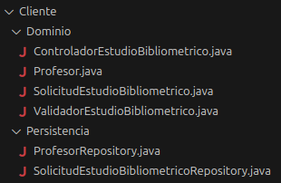

## 🧩 Grupo Funcional 6 — Lado Cliente

Este módulo contiene la documentación completa del **lado cliente** del Grupo Funcional 6, incluyendo tanto los **requisitos funcionales**, como los **casos de uso** correspondientes.

El objetivo de este grupo funcional en el cliente es cubrir:

* **Solicitar estudios bibliométricos** por parte del profesor.

---

## 📊 Diagrama de Casos de Uso (Cliente)

El siguiente diagrama representa la interacción entre los actores del lado cliente (profesor) y el caso de uso asociado al requisito funcional **RF-11**.

---

## 📃 Resumen de Casos de Uso del Cliente

| ID        | Caso de Uso                     | Actor Principal | Descripción breve                                                                      |
| --------- | ------------------------------- | --------------- | -------------------------------------------------------------------------------------- |
| **CU-11** | Solicitar estudio bibliométrico | Profesor        | Permite al profesor solicitar estudios bibliométricos o estadísticas de investigación. |

---

## 📌 Descripción de Casos de Uso

A continuación se encuentra el caso de uso detallado que forma parte de este grupo funcional. Cada uno incluye: actores, precondiciones, postcondiciones, flujo normal, flujos alternativos y reglas de negocio.

---

### 🎓 **CU-11 — Solicitar estudio bibliométrico**

**Requisito asociado:** RF-11
**Actor principal:** Profesor

**Descripción:**
El sistema permite al profesor solicitar un estudio bibliométrico basado en diversos parámetros (citas, autor, publicaciones, etc.).

**Precondiciones:**

* El profesor ha iniciado sesión correctamente.
* El sistema tiene acceso a los datos necesarios para generar el estudio.

**Postcondiciones:**

* El sistema genera y envía la solicitud de estudio al servidor para su procesamiento.

**Flujo principal:**

1. El profesor accede al módulo de estudios bibliométricos.
2. El sistema muestra las opciones de personalización del estudio.
3. El profesor selecciona los parámetros del estudio.
4. El sistema valida la solicitud.
5. El sistema envía la solicitud al servidor para su procesamiento.

**Flujos alternativos:**

* No se encuentran datos suficientes para realizar el estudio.
* El formato de los parámetros de búsqueda es incorrecto.

---

## 🧠 2. Fase de Análisis — Diagramas del Servidor

# Diagrama de análisis del caso de uso:

## 📐 Diagrama de Clases – Cliente (CU: Petición de Estudios Bibliométricos)

Este apartado describe el **diagrama de clases del lado cliente**, elaborado siguiendo el modelo  
**Presentación – Dominio – Persistencia**, y basado exclusivamente en los diagramas funcionales proporcionados.

---

## 🖥️ Capa de Presentación

### UIEstudiosbibliometricos
Clase responsable de la interacción con el usuario para la solicitud de estudios bibliométricos.

**Métodos principales:**
- `solicitarEstudio() : void`
- `mostrarResultado(msg : String) : void`
- `mostrarError(msg : String) : void`

**Relaciones:**
- Depende de `ControladorEstudioBibliometrico`

---

## 🧠 Capa de Dominio

### ControladorEstudioBibliometrico
Gestiona el flujo del caso de uso y coordina la validación y el acceso a persistencia.

**Métodos principales:**
- `solicitarEstudio(solicitud : SolicitudEstudioBibliometrico) : void`

**Relaciones:**
- Usa `ValidadorEstudioBibliometrico`
- Accede a `SolicitudEstudioBibliometricoRepository`
- Accede a `ProfesorRepository`

---

### ValidadorEstudioBibliometrico
Encargado de validar los datos de la solicitud antes de su procesamiento.

**Métodos principales:**
- `validar(solicitud : SolicitudEstudioBibliometrico) : boolean`

---

### SolicitudEstudioBibliometrico
Entidad de dominio que representa la solicitud de un estudio bibliométrico.

**Atributos:**
- `profesor : Profesor`
- `parametros : String`

**Métodos principales:**
- `getProfesor() : Profesor`
- `setProfesor(p : Profesor) : void`
- `getParametros() : String`
- `setParametros(p : String) : void`

**Relaciones:**
- Asociación **1..1** con `Profesor`

---

### Profesor
Entidad de dominio que representa al profesor solicitante.

**Atributos:**
- `id : String`
- `nombre : String`

**Métodos principales:**
- `getId() : String`
- `setId(id : String) : void`
- `getNombre() : String`
- `setNombre(n : String) : void`

---

## 🗄️ Capa de Persistencia

### SolicitudEstudioBibliometricoRepository
Repositorio encargado de la gestión de solicitudes de estudios bibliométricos.

**Atributos:**
- `solicitudes : List<SolicitudEstudioBibliometrico>`

**Métodos de consulta:**
- `obtenerTodas() : List<SolicitudEstudioBibliometrico>`
- `obtenerPorProfesor(profesor : Profesor) : SolicitudEstudioBibliometrico`
- `existeSolicitud(profesor : Profesor) : boolean`

---

### ProfesorRepository
Repositorio encargado de la gestión de profesores.

**Atributos:**
- `profesores : List<Profesor>`

**Métodos de consulta:**
- `obtenerPorId(id : String) : Profesor`
- `obtenerTodos() : List<Profesor>`
- `existeProfesor(id : String) : boolean`

---

## 🔗 Relaciones entre Clases

- `UIEstudiosbibliometricos` → `ControladorEstudioBibliometrico` (dependencia)
- `ControladorEstudioBibliometrico` → `ValidadorEstudioBibliometrico` (dependencia)
- `ControladorEstudioBibliometrico` → `SolicitudEstudioBibliometricoRepository` (dependencia)
- `ControladorEstudioBibliometrico` → `ProfesorRepository` (dependencia)
- `SolicitudEstudioBibliometrico` — `Profesor` (asociación **1..1**)
- `SolicitudEstudioBibliometricoRepository` — `SolicitudEstudioBibliometrico`
- `ProfesorRepository` — `Profesor`

---

Este diseño garantiza una **separación clara de responsabilidades** y mantiene coherencia con la arquitectura utilizada en el lado servidor del proyecto.

## 💻 3. Fase de Implementación

En esta fase se llevará a cabo la implementación del código del cliente acorde a los diagramas anteriores, por medio de ingeniería directa.

### ⚙️  Backend

