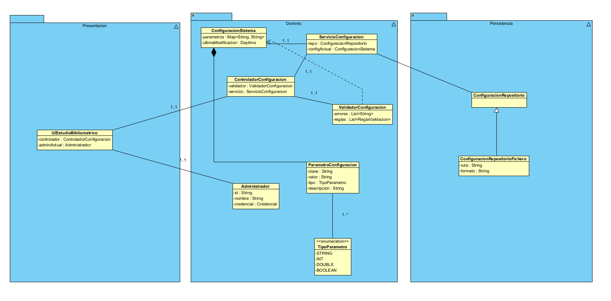
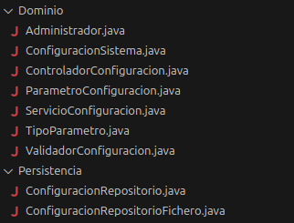
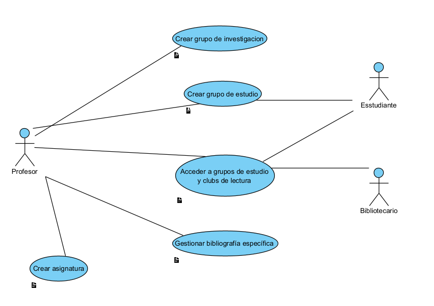
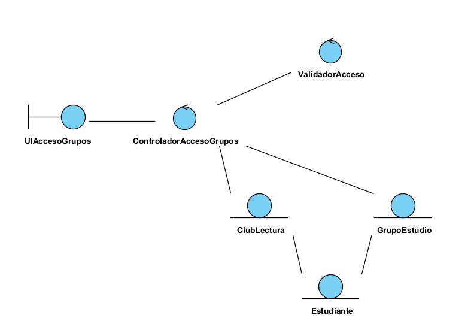
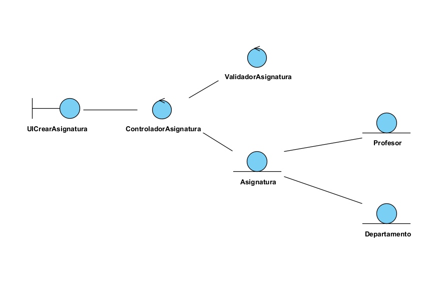
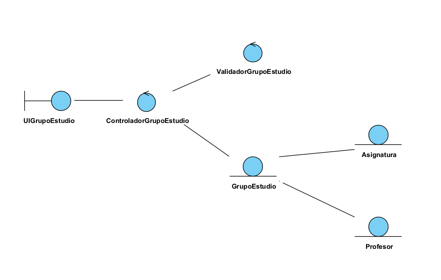
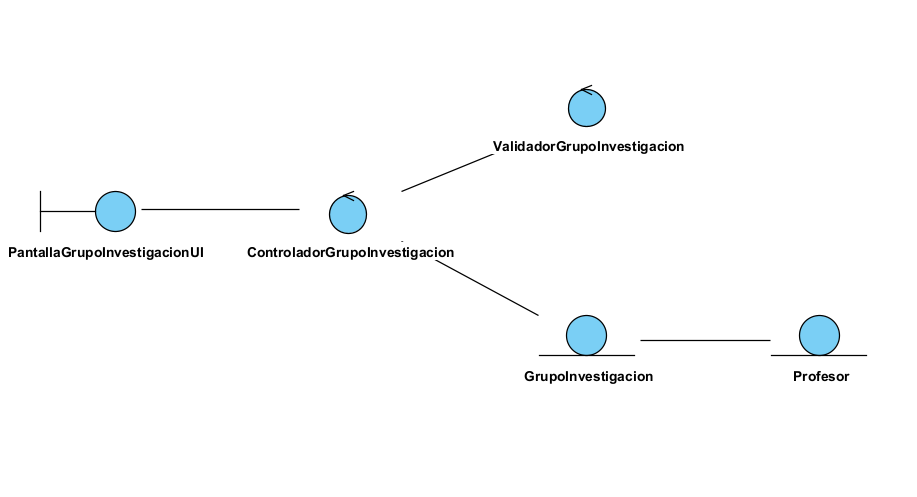
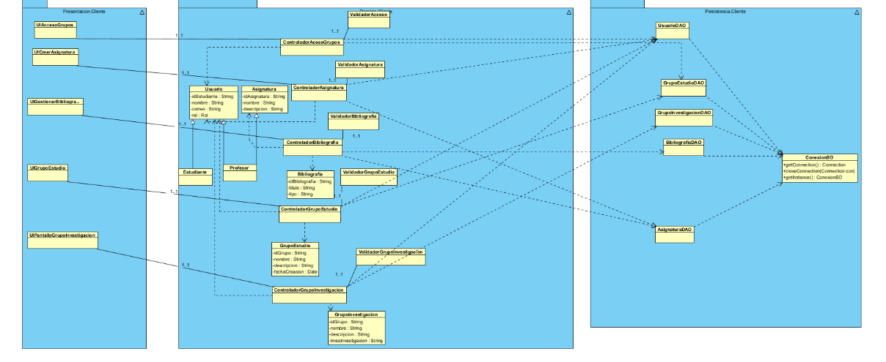

## 🧩 Grupo Funcional 7 — Lado Cliente

Este módulo contiene la documentación correspondiente al **lado cliente** del Grupo Funcional 7, incluyendo el **requisito funcional RF-16** y su análisis asociado.

El objetivo de este grupo funcional en el cliente es cubrir:

* **Gestión y configuración del sistema** por parte del usuario administrador.
* Consideración de la **interoperabilidad** del sistema con otros servicios universitarios (RNF-10).

---

## 📊 Diagrama de Casos de Uso (Cliente)

El siguiente diagrama representa la interacción entre el actor del lado cliente (Administrador del sistema) y el caso de uso asociado al requisito funcional **RF-16**.

---

## 📃 Resumen de Casos de Uso del Cliente

| ID        | Caso de Uso                       | Actor Principal | Descripción breve                                                              |
| --------- | --------------------------------- | --------------- | ------------------------------------------------------------------------------ |
| **CU-16** | Gestionar y configurar el sistema | Administrador   | Permite ajustar parámetros generales del sistema desde la interfaz de usuario. |

---

## 📌 Descripción de Casos de Uso

A continuación se encuentra el caso de uso detallado que forma parte de este grupo funcional.
Incluye actores, precondiciones, postcondiciones, flujo normal, flujos alternativos y reglas de negocio.

---

### ⚙️ **CU-16 — Gestionar y configurar el sistema**

**Requisito asociado:** RF-16
**Actor principal:** Administrador del sistema

---

### **Descripción**

El sistema permite al administrador gestionar y configurar los parámetros generales de funcionamiento desde el lado cliente, tales como políticas de préstamo, horarios de servicio, sanciones y otros ajustes globales.

Esta configuración se realiza mediante una interfaz gráfica que centraliza las opciones de administración del sistema.

---

### **Precondiciones**

* El administrador ha iniciado sesión correctamente.
* El administrador dispone de permisos de configuración del sistema.

---

### **Postcondiciones**

* Los parámetros configurados quedan guardados y enviados al servidor.
* El sistema aplica la nueva configuración de forma global.

---

### **Flujo principal**

1. El administrador accede al módulo de configuración del sistema.
2. El sistema muestra los parámetros configurables disponibles.
3. El administrador modifica los valores deseados.
4. El sistema valida los datos introducidos.
5. El sistema envía la configuración al servidor.
6. El sistema confirma que los cambios han sido aplicados correctamente.

---

### **Flujos alternativos**

* Los valores introducidos no cumplen las restricciones definidas.
* Error de comunicación con el servidor.
* El administrador cancela la operación antes de confirmar los cambios.

---

### **Reglas de negocio**

* Solo los usuarios con rol de administrador pueden acceder a este módulo.
* Los valores introducidos deben respetar los límites y formatos definidos.
* Los cambios de configuración afectan al comportamiento global del sistema.

---

## 🧠 2. Fase de Análisis — Diagrama de Análisis del Cliente

El siguiente diagrama representa la estructura lógica del lado cliente para el caso de uso **CU-16**, mostrando la interacción entre la interfaz de usuario, los controladores de aplicación y las entidades utilizadas para gestionar la configuración del sistema.

---

## 📌 Consideración del Requisito No Funcional RNF-10

**RNF-10 — Interoperabilidad**

El cliente debe estar diseñado para permitir la integración con otros servicios universitarios externos, tales como:

* Sistemas académicos.
* Bases de datos institucionales.
* Servicios de estadísticas y gestión docente.

Este requisito no funcional condiciona el diseño del cliente, asegurando que los datos de configuración y las solicitudes se envían mediante interfaces estándar y mecanismos compatibles con servicios externos.

---

## 🧩 Diagrama de Clases – Componente Cliente (Configuración del Sistema)

En esta iteración se ha definido el **diagrama de clases del lado cliente** para el **caso de uso _“Administrar y configurar el sistema”_**, siguiendo una arquitectura **en capas** que separa claramente **presentación, dominio y persistencia**.

---

## 📐 Arquitectura en Capas

El diseño del componente cliente se organiza en tres capas bien diferenciadas:

- **Presentación**: gestiona la interacción entre el administrador y el sistema.
- **Dominio**: contiene la lógica de negocio asociada a la configuración.
- **Persistencia**: se encarga del almacenamiento y recuperación de la configuración del sistema.

Esta separación permite mejorar la **mantenibilidad**, **escalabilidad** y **testabilidad** del sistema.

---

## 🖥️ Capa de Presentación

### `UIEstudioBibliometrico`

Clase responsable de la interacción con el **Administrador**.

**Responsabilidades:**
- Mostrar la interfaz de configuración del sistema.
- Recoger los datos introducidos por el administrador.
- Delegar las acciones al controlador de configuración.

**Atributos principales:**
- `controlador : ControladorConfiguracion`
- `adminActual : Administrador`

**Relaciones:**
- Asociación 1..1 con `ControladorConfiguracion`.
- Asociación 1..1 con `Administrador`.

---

## ⚙️ Capa de Dominio

### `ControladorConfiguracion`

Actúa como intermediario entre la interfaz de usuario y la lógica de negocio.

**Responsabilidades:**
- Recibir solicitudes desde la capa de presentación.
- Coordinar la validación de los datos.
- Delegar la aplicación de cambios al servicio de configuración.

**Atributos:**
- `validador : ValidadorConfiguracion`
- `servicio : ServicioConfiguracion`

---

### `ServicioConfiguracion`

Encapsula la lógica de negocio relacionada con la configuración del sistema.

**Responsabilidades:**
- Gestionar la configuración activa del sistema.
- Coordinar la carga y persistencia de la configuración.

**Atributos:**
- `repo : ConfiguracionRepositorio`
- `configActual : ConfiguracionSistema`

---

### `ValidadorConfiguracion`

Clase encargada de comprobar la validez de los datos de configuración.

**Responsabilidades:**
- Verificar reglas y restricciones de los parámetros.
- Registrar errores de validación.

**Atributos:**
- `errores : List<String>`
- `reglas : List<ReglaValidacion>`

---

### `ConfiguracionSistema`

Entidad principal del dominio que representa la configuración global del sistema.

**Atributos:**
- `parametros : Map<String, String>`
- `ultimaModificacion : Datetime`

**Relaciones:**
- Composición con `ParametroConfiguracion`, ya que los parámetros no existen fuera de la configuración del sistema.

---

### `ParametroConfiguracion`

Representa un parámetro individual del sistema.

**Atributos:**
- `clave : String`
- `valor : String`
- `tipo : TipoParametro`
- `descripcion : String`

---

### `TipoParametro` (Enumeración)

Define los tipos admitidos para los parámetros de configuración:
- `STRING`
- `INT`
- `DOUBLE`
- `BOOLEAN`

---

### `Administrador`

Entidad que representa al usuario con permisos de administración y configuración.

**Atributos:**
- `id : String`
- `nombre : String`
- `credencial : Credencial`

---

## 💾 Capa de Persistencia

### `ConfiguracionRepositorio`

Interfaz que define el contrato para el acceso a la configuración del sistema.

**Responsabilidades:**
- Cargar la configuración persistida.
- Guardar los cambios realizados.

---

### `ConfiguracionRepositorioFichero`

Implementación concreta del repositorio basada en almacenamiento en fichero.

**Atributos:**
- `ruta : String`
- `formato : String`

**Relaciones:**
- Implementa la interfaz `ConfiguracionRepositorio`.

---

## 🔗 Relaciones clave del diagrama

- La capa de **presentación** se comunica exclusivamente con el **controlador**.
- El **controlador** delega la lógica de negocio en el **servicio de configuración**.
- El **servicio** gestiona la entidad `ConfiguracionSistema` y accede a persistencia mediante un repositorio.
- La validación se realiza de forma desacoplada mediante `ValidadorConfiguracion`.
- La persistencia se abstrae mediante una interfaz, permitiendo futuras implementaciones (BD, API, etc.).

---

## ✅ Conclusión

El diagrama de clases del componente cliente introduce un modelo coherente y alineado con los patrones **MVC** y **Repository**, asegurando:

- Bajo acoplamiento entre capas.
- Alta cohesión de responsabilidades.
- Facilidad de mantenimiento y extensión en futuras iteraciones.

## 💻 3. Fase de Implementación

En esta fase se llevará a cabo la implementación del código del cliente acorde a los diagramas anteriores, por medio de ingeniería directa.

### ⚙️  Backend

---

# 🧪 4. *Fase de Testing*

En esta fase se comprobará el código realizado en la fase anterior mediante el uso de tests unitarios.

# 🧩 Grupo Funcional 5 — Lado Cliente

Este módulo contiene la documentación completa del **lado cliente** del Grupo Funcional 5, incluyendo tanto los **requisitos funcionales**, como los **casos de uso** y los **diagramas de análisis** correspondientes.

El objetivo de este grupo funcional en el cliente es cubrir:

* Acceso y unión a grupos de estudio y clubs de lectura
* Creación de asignaturas
* Gestión de bibliografía por parte del profesor
* Creación de grupos de estudio
* Creación de grupos de investigación

---

## 📊 Diagrama de Casos de Uso (Cliente)

El siguiente diagrama representa la interacción entre los actores del lado cliente (estudiante y profesor) y los casos de uso asociados a los requisitos funcionales RF-06 a RF-10.

---

## 📃 Resumen de Casos de Uso del Cliente

| ID | Caso de Uso | Actor Principal | Descripción breve |
|----|--------------|-----------------|-------------------|
| **CU-06** | Acceder a grupos de estudio y clubs de lectura | Estudiante | Permite visualizar y unirse a grupos creados por profesores o la biblioteca. |
| **CU-07** | Crear asignatura | Profesor | Permite registrar nuevas asignaturas en el sistema. |
| **CU-08** | Gestionar bibliografía específica | Profesor | Permite asociar material bibliográfico a las asignaturas creadas. |
| **CU-09** | Crear grupo de estudio | Profesor | Permite crear grupos de estudio vinculados a sus asignaturas. |
| **CU-10** | Crear grupo de investigación | Profesor | Permite crear grupos de investigación asociados a líneas o proyectos. |

---

## 📌 Descripción de Casos de Uso

A continuación se encuentran los casos de uso detallados que forman parte de este grupo funcional. Cada uno incluye: actores, precondiciones, postcondiciones, flujo normal, flujos alternativos y reglas de negocio.

---

### 🎓 **CU-06 — Acceder a grupos de estudio y clubs de lectura**  
**Requisito asociado:** RF-06  
**Actor principal:** Estudiante  

**Descripción:**  
El sistema permite al estudiante visualizar los grupos disponibles y unirse a aquellos que estén activos.

**Precondiciones:**  
- El estudiante ha iniciado sesión mediante SSO.
- Existen grupos disponibles.

**Postcondiciones:**  
- El estudiante queda unido al grupo seleccionado.

**Flujo principal:**  
1. El estudiante accede al módulo de grupos.  
2. El sistema muestra los grupos disponibles.  
3. Selecciona un grupo y visualiza la información.  
4. Solicita unirse.  
5. El sistema confirma la operación.  

**Flujos alternativos:**  
- El grupo está completo.  
- El grupo es privado y requiere aprobación.  

**Reglas de negocio:**  
- El estudiante puede unirse a múltiples grupos.  
- Los grupos pueden ser públicos o privados.

---

### 🧑‍🏫 **CU-07 — Crear asignatura**  
**Requisito asociado:** RF-07  
**Actor principal:** Profesor  

**Descripción:**  
Permite a un profesor crear asignaturas nuevas en el sistema.

**Precondiciones:**  
- El profesor tiene permisos adecuados.  

**Postcondiciones:**  
- La asignatura queda registrada.  

**Flujo principal:**  
1. El profesor accede a “Mis asignaturas”.  
2. Selecciona “Crear asignatura”.  
3. Introduce los datos requeridos.  
4. El sistema valida la información.  
5. La asignatura es creada.  

**Flujos alternativos:**  
- Código ya existente.  
- Datos incompletos.  

**Reglas de negocio:**  
- El código debe ser único.  

---

### 📚 **CU-08 — Gestionar bibliografía específica**  
**Requisito asociado:** RF-08  
**Actor principal:** Profesor  

**Descripción:**  
El profesor puede añadir, eliminar o modificar bibliografía recomendada para una asignatura.

**Precondiciones:**  
- La asignatura existe.  
- El recurso bibliográfico está registrado.  

**Postcondiciones:**  
- La bibliografía queda actualizada.  

**Flujo principal:**  
1. El profesor abre la asignatura.  
2. Accede a “Bibliografía recomendada”.  
3. Añade o elimina recursos.  
4. El sistema valida los cambios.  
5. Se actualiza la lista.

**Flujos alternativos:**  
- Recurso no existe.  
- El recurso es obligatorio y no puede eliminarse.

---

### 👥 **CU-09 — Crear grupo de estudio**  
**Requisito asociado:** RF-09  
**Actor principal:** Profesor  

**Descripción:**  
Permite crear grupos de estudio asociados a una asignatura.

**Precondiciones:**  
- La asignatura existe y pertenece al profesor.

**Postcondiciones:**  
- El grupo queda visible para estudiantes.

**Flujo principal:**  
1. Seleccionar asignatura.  
2. Pulsar “Crear grupo de estudio”.  
3. Introducir datos.  
4. Validación.  
5. Registro del grupo.

**Flujos alternativos:**  
- Datos incompletos.  
- Nombre duplicado.

---

### 🔬 **CU-10 — Crear grupo de investigación**  
**Requisito asociado:** RF-10  
**Actor principal:** Profesor  

**Descripción:**  
Permite al profesor crear grupos de investigación.

**Precondiciones:**  
- El profesor pertenece a un departamento válido.

**Postcondiciones:**  
- El grupo queda registrado.

**Flujo principal:**  
1. Acceder al módulo “Grupos de investigación”.  
2. Pulsar “Crear grupo”.  
3. Introducir nombre, temática y miembros.  
4. Validación.  
5. Confirmación.

**Flujos alternativos:**  
- Nombre duplicado.  
- Miembros inválidos.

---

# 🧠 2. Fase de Análisis — Diagramas de Análisis de Clases

Los siguientes diagramas representan la estructura lógica interna del lado cliente para cada caso de uso.

---

## 🎓 **Análisis CU-06 — Acceder a grupos de estudio y clubs de lectura**

---

## 🧑‍🏫 **Análisis CU-07 — Crear asignatura**

---

## 📚 **Análisis CU-08 — Gestionar bibliografía específica**

---

## 👥 **Análisis CU-09 — Crear grupo de estudio**

---

## 🔬 **Análisis CU-10 — Crear grupo de investigación**

---

# 🧩 Diagrama de Clases del Cliente (GF5)

El siguiente diagrama representa la arquitectura interna del **cliente** desarrollada para el Grupo Funcional 5 (GF5).  
Este diseño define las pantallas del usuario, los controladores de interacción, los validadores y las entidades que permiten gestionar asignaturas, bibliografía y grupos académicos desde el lado cliente.

El objetivo de esta versión es documentar la estructura utilizada en el cliente y asegurar su coherencia con los requisitos funcionales **RF-06, RF-07, RF-08, RF-09 y RF-10**.

---

## 🖥️ 1. Capa de Presentación — `Presentation.client`

Esta capa contiene todas las **interfaces de usuario (UI)** que interactúan directamente con el usuario final.

### ✔ Pantallas del cliente

- `UIAccesoGrupos`
- `UICrearAsignatura`
- `UIGestionBibliografia`
- `UIGrupoEstudio`
- `PantallaGrupoInvestigacionUI`

### ✔ Funciones principales

- Mostrar información obtenida del servidor.  
- Recoger datos y acciones del usuario.  
- Validar datos básicos.  
- Invocar a los controladores correspondientes.  
- Gestionar la navegación entre pantallas.

> Esta capa NO realiza lógica de negocio.
---

## 🧠 2. Capa de Control — `Application.client`

Incluye los controladores del cliente que coordinan la interfaz con las entidades del dominio y preparan las operaciones que serán enviadas al servidor.

### ✔ Controladores del cliente

- `ControladorAccesoGrupos`
- `ControladorAsignatura`
- `ControladorBibliografia`
- `ControladorGrupoEstudio`
- `ControladorGrupoInvestigacion`

### ✔ Validadores asociados

- `ValidadorAcceso`
- `ValidadorAsignatura`
- `ValidadorBibliografia`
- `ValidadorGrupoEstudio`
- `ValidadorGrupoInvestigacion`

### ✔ Responsabilidades

- Validación previa de datos antes de mandarlos al servidor.  
- Construcción de los objetos enviados al dominio.  
- Coordinación entre pantallas.  
- Gestión de errores enviados por el backend.  

> Esta capa NO accede a la base de datos.
---

## 🧱 3. Capa de Dominio — `Domain.client`

Modela las entidades que utiliza el cliente para representar la información proveniente del servidor.

### ✔ Entidades modeladas

- `Asignatura`
- `Bibliografia`
- `GrupoEstudio`
- `GrupoInvestigacion`
- `Usuario`  
  - `Profesor`  
  - `Estudiante`

Estas clases sirven para almacenar y manipular datos que el servidor envía y que el cliente debe representar o utilizar en las operaciones de los casos de uso.

---

## 📌 Relación con los Casos de Uso del Cliente

| Caso de Uso | Controlador Cliente | Entidades Involucradas |
|-------------|--------------------|--------------------------|
| RF-06 — Acceder a grupo | `ControladorAccesoGrupos` | `Estudiante`, `GrupoEstudio` |
| RF-07 — Crear asignatura | `ControladorAsignatura` | `Asignatura`, `Profesor` |
| RF-08 — Gestionar bibliografía | `ControladorBibliografia` | `Asignatura`, `Bibliografia` |
| RF-09 — Registrar grupo de estudio | `ControladorGrupoEstudio` | `GrupoEstudio`, `Asignatura` |
| RF-10 — Registrar grupo de investigación | `ControladorGrupoInvestigacion` | `GrupoInvestigacion`, `Profesor` |

---

## 🖼️ Diagrama de Clases del Cliente (GF5)

---

# 🧪 *Fase de Testing*

En esta fase realizaremos tests al código del cliente implementado haciendo uso de junit.

