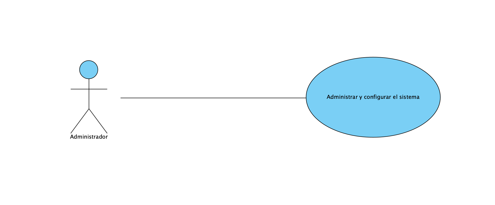
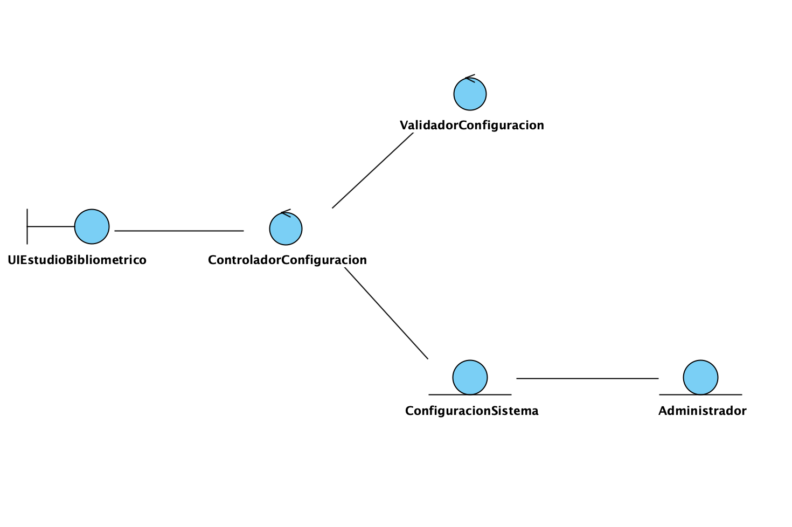

## 🧩 Grupo Funcional 7 — Lado Cliente

Este módulo contiene la documentación correspondiente al **lado cliente** del Grupo Funcional 7, incluyendo el **requisito funcional RF-16** y su análisis asociado.

El objetivo de este grupo funcional en el cliente es cubrir:

* **Gestión y configuración del sistema** por parte del usuario administrador.
* Consideración de la **interoperabilidad** del sistema con otros servicios universitarios (RNF-10).

---

## 📊 Diagrama de Casos de Uso (Cliente)

El siguiente diagrama representa la interacción entre el actor del lado cliente (Administrador del sistema) y el caso de uso asociado al requisito funcional **RF-16**.

---

## 📃 Resumen de Casos de Uso del Cliente

| ID        | Caso de Uso                       | Actor Principal | Descripción breve                                                              |
| --------- | --------------------------------- | --------------- | ------------------------------------------------------------------------------ |
| **CU-16** | Gestionar y configurar el sistema | Administrador   | Permite ajustar parámetros generales del sistema desde la interfaz de usuario. |

---

## 📌 Descripción de Casos de Uso

A continuación se encuentra el caso de uso detallado que forma parte de este grupo funcional.
Incluye actores, precondiciones, postcondiciones, flujo normal, flujos alternativos y reglas de negocio.

---

### ⚙️ **CU-16 — Gestionar y configurar el sistema**

**Requisito asociado:** RF-16
**Actor principal:** Administrador del sistema

---

### **Descripción**

El sistema permite al administrador gestionar y configurar los parámetros generales de funcionamiento desde el lado cliente, tales como políticas de préstamo, horarios de servicio, sanciones y otros ajustes globales.

Esta configuración se realiza mediante una interfaz gráfica que centraliza las opciones de administración del sistema.

---

### **Precondiciones**

* El administrador ha iniciado sesión correctamente.
* El administrador dispone de permisos de configuración del sistema.

---

### **Postcondiciones**

* Los parámetros configurados quedan guardados y enviados al servidor.
* El sistema aplica la nueva configuración de forma global.

---

### **Flujo principal**

1. El administrador accede al módulo de configuración del sistema.
2. El sistema muestra los parámetros configurables disponibles.
3. El administrador modifica los valores deseados.
4. El sistema valida los datos introducidos.
5. El sistema envía la configuración al servidor.
6. El sistema confirma que los cambios han sido aplicados correctamente.

---

### **Flujos alternativos**

* Los valores introducidos no cumplen las restricciones definidas.
* Error de comunicación con el servidor.
* El administrador cancela la operación antes de confirmar los cambios.

---

### **Reglas de negocio**

* Solo los usuarios con rol de administrador pueden acceder a este módulo.
* Los valores introducidos deben respetar los límites y formatos definidos.
* Los cambios de configuración afectan al comportamiento global del sistema.

---

## 🧠 2. Fase de Análisis — Diagrama de Análisis del Cliente

El siguiente diagrama representa la estructura lógica del lado cliente para el caso de uso **CU-16**, mostrando la interacción entre la interfaz de usuario, los controladores de aplicación y las entidades utilizadas para gestionar la configuración del sistema.

---

## 📌 Consideración del Requisito No Funcional RNF-10

**RNF-10 — Interoperabilidad**

El cliente debe estar diseñado para permitir la integración con otros servicios universitarios externos, tales como:

* Sistemas académicos.
* Bases de datos institucionales.
* Servicios de estadísticas y gestión docente.

Este requisito no funcional condiciona el diseño del cliente, asegurando que los datos de configuración y las solicitudes se envían mediante interfaces estándar y mecanismos compatibles con servicios externos.

---

## 🧩 Diagrama de Clases – Componente Cliente (Configuración del Sistema)

En esta iteración se ha definido el **diagrama de clases del lado cliente** para el **caso de uso _“Administrar y configurar el sistema”_**, siguiendo una arquitectura **en capas** que separa claramente **presentación, dominio y persistencia**.

---

## 📐 Arquitectura en Capas

El diseño del componente cliente se organiza en tres capas bien diferenciadas:

- **Presentación**: gestiona la interacción entre el administrador y el sistema.
- **Dominio**: contiene la lógica de negocio asociada a la configuración.
- **Persistencia**: se encarga del almacenamiento y recuperación de la configuración del sistema.

Esta separación permite mejorar la **mantenibilidad**, **escalabilidad** y **testabilidad** del sistema.

---

## 🖥️ Capa de Presentación

### `UIEstudioBibliometrico`

Clase responsable de la interacción con el **Administrador**.

**Responsabilidades:**
- Mostrar la interfaz de configuración del sistema.
- Recoger los datos introducidos por el administrador.
- Delegar las acciones al controlador de configuración.

**Atributos principales:**
- `controlador : ControladorConfiguracion`
- `adminActual : Administrador`

**Relaciones:**
- Asociación 1..1 con `ControladorConfiguracion`.
- Asociación 1..1 con `Administrador`.

---

## ⚙️ Capa de Dominio

### `ControladorConfiguracion`

Actúa como intermediario entre la interfaz de usuario y la lógica de negocio.

**Responsabilidades:**
- Recibir solicitudes desde la capa de presentación.
- Coordinar la validación de los datos.
- Delegar la aplicación de cambios al servicio de configuración.

**Atributos:**
- `validador : ValidadorConfiguracion`
- `servicio : ServicioConfiguracion`

---

### `ServicioConfiguracion`

Encapsula la lógica de negocio relacionada con la configuración del sistema.

**Responsabilidades:**
- Gestionar la configuración activa del sistema.
- Coordinar la carga y persistencia de la configuración.

**Atributos:**
- `repo : ConfiguracionRepositorio`
- `configActual : ConfiguracionSistema`

---

### `ValidadorConfiguracion`

Clase encargada de comprobar la validez de los datos de configuración.

**Responsabilidades:**
- Verificar reglas y restricciones de los parámetros.
- Registrar errores de validación.

**Atributos:**
- `errores : List<String>`
- `reglas : List<ReglaValidacion>`

---

### `ConfiguracionSistema`

Entidad principal del dominio que representa la configuración global del sistema.

**Atributos:**
- `parametros : Map<String, String>`
- `ultimaModificacion : Datetime`

**Relaciones:**
- Composición con `ParametroConfiguracion`, ya que los parámetros no existen fuera de la configuración del sistema.

---

### `ParametroConfiguracion`

Representa un parámetro individual del sistema.

**Atributos:**
- `clave : String`
- `valor : String`
- `tipo : TipoParametro`
- `descripcion : String`

---

### `TipoParametro` (Enumeración)

Define los tipos admitidos para los parámetros de configuración:
- `STRING`
- `INT`
- `DOUBLE`
- `BOOLEAN`

---

### `Administrador`

Entidad que representa al usuario con permisos de administración y configuración.

**Atributos:**
- `id : String`
- `nombre : String`
- `credencial : Credencial`

---

## 💾 Capa de Persistencia

### `ConfiguracionRepositorio`

Interfaz que define el contrato para el acceso a la configuración del sistema.

**Responsabilidades:**
- Cargar la configuración persistida.
- Guardar los cambios realizados.

---

### `ConfiguracionRepositorioFichero`

Implementación concreta del repositorio basada en almacenamiento en fichero.

**Atributos:**
- `ruta : String`
- `formato : String`

**Relaciones:**
- Implementa la interfaz `ConfiguracionRepositorio`.

---

## 🔗 Relaciones clave del diagrama

- La capa de **presentación** se comunica exclusivamente con el **controlador**.
- El **controlador** delega la lógica de negocio en el **servicio de configuración**.
- El **servicio** gestiona la entidad `ConfiguracionSistema` y accede a persistencia mediante un repositorio.
- La validación se realiza de forma desacoplada mediante `ValidadorConfiguracion`.
- La persistencia se abstrae mediante una interfaz, permitiendo futuras implementaciones (BD, API, etc.).

---

## ✅ Conclusión

El diagrama de clases del componente cliente introduce un modelo coherente y alineado con los patrones **MVC** y **Repository**, asegurando:

- Bajo acoplamiento entre capas.
- Alta cohesión de responsabilidades.
- Facilidad de mantenimiento y extensión en futuras iteraciones.

