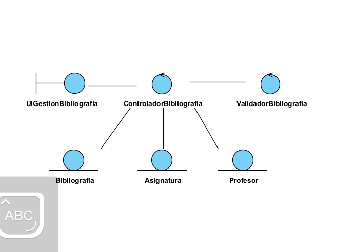
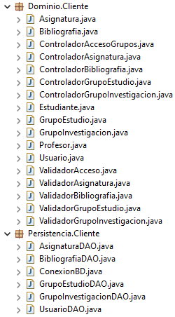
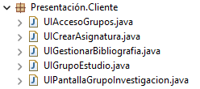

# 🧩 Grupo Funcional 5 — Lado Cliente

Este módulo contiene la documentación completa del **lado cliente** del Grupo Funcional 5, incluyendo tanto los **requisitos funcionales**, como los **casos de uso** y los **diagramas de análisis** correspondientes.

El objetivo de este grupo funcional en el cliente es cubrir:

* Acceso y unión a grupos de estudio y clubs de lectura
* Creación de asignaturas
* Gestión de bibliografía por parte del profesor
* Creación de grupos de estudio
* Creación de grupos de investigación

---

## 📊 Diagrama de Casos de Uso (Cliente)

El siguiente diagrama representa la interacción entre los actores del lado cliente (estudiante y profesor) y los casos de uso asociados a los requisitos funcionales RF-06 a RF-10.

---

# 📃 Resumen de Casos de Uso del Cliente

| ID        | Caso de Uso                                    | Actor Principal | Descripción breve                                                   |
| --------- | ---------------------------------------------- | --------------- | ------------------------------------------------------------------- |
| **CU-06** | Acceder a grupos de estudio y clubs de lectura | Estudiante      | Permite visualizar grupos disponibles y unirse a ellos.             |
| **CU-07** | Crear asignatura                               | Profesor        | Permite registrar nuevas asignaturas en el sistema.                 |
| **CU-08** | Gestionar bibliografía específica              | Profesor        | Permite asociar material bibliográfico a las asignaturas.           |
| **CU-09** | Crear grupo de estudio                         | Profesor        | Permite crear grupos de estudio vinculados a una asignatura.        |
| **CU-10** | Crear grupo de investigación                   | Profesor        | Permite crear grupos de investigación asociados a líneas/proyectos. |

---

# 📌 1. Descripción de Casos de Uso

## 🎓 **CU-06 — Acceder a grupos de estudio y clubs de lectura**

**Requisito asociado:** RF-06
**Actor principal:** Estudiante

**Descripción:**
El estudiante visualiza los grupos disponibles y puede unirse a ellos.

**Precondiciones:**

* El estudiante ha iniciado sesión mediante SSO.
* Existen grupos disponibles.

**Postcondiciones:**

* El estudiante queda unido al grupo seleccionado.

**Flujo principal:**

1. Accede al módulo de grupos.
2. El sistema muestra los grupos disponibles.
3. Selecciona un grupo.
4. Consulta información detallada.
5. Solicita unirse.
6. El sistema confirma la operación.

**Flujos alternativos:**

* El grupo está completo.
* El grupo es privado y requiere aprobación.

---

## 🧑‍🏫 **CU-07 — Crear asignatura**

**Requisito asociado:** RF-07
**Actor principal:** Profesor

**Descripción:**
Permite registrar nuevas asignaturas en el sistema.

**Precondiciones:**

* El profesor tiene permisos adecuados.

**Postcondiciones:**

* La asignatura queda registrada.

**Flujo principal:**

1. Accede a “Mis asignaturas”.
2. Selecciona “Crear asignatura”.
3. Rellena los datos requeridos.
4. El sistema valida la información.
5. La asignatura se crea correctamente.

**Flujos alternativos:**

* Código de asignatura ya existente.
* Datos incompletos.

---

## 📚 **CU-08 — Gestionar bibliografía específica**

**Requisito asociado:** RF-08
**Actor principal:** Profesor

**Descripción:**
Permite añadir, eliminar o modificar bibliografía recomendada.

**Precondiciones:**

* La asignatura existe.
* Los recursos bibliográficos son válidos.

**Postcondiciones:**

* La lista de bibliografía queda actualizada.

**Flujo principal:**

1. Abre la asignatura.
2. Accede a “Bibliografía específica”.
3. Añade o elimina recursos.
4. El sistema valida los cambios.
5. Actualiza la lista.

---

## 👥 **CU-09 — Crear grupo de estudio**

**Requisito asociado:** RF-09
**Actor principal:** Profesor

**Descripción:**
Permite al profesor crear grupos de estudio asociados a sus asignaturas.

**Precondiciones:**

* La asignatura existe y pertenece al profesor.

**Postcondiciones:**

* El grupo queda visible para los estudiantes.

**Flujo principal:**

1. Selecciona la asignatura.
2. Pulsa “Crear grupo de estudio”.
3. Introduce los datos.
4. Validación.
5. Registro del grupo.

---

## 🔬 **CU-10 — Crear grupo de investigación**

**Requisito asociado:** RF-10
**Actor principal:** Profesor

**Descripción:**
Permite crear grupos de investigación académica.

**Precondiciones:**

* El profesor pertenece a un departamento válido.

**Postcondiciones:**

* El grupo queda registrado.

**Flujo principal:**

1. Accede al módulo “Grupos de investigación”.
2. Pulsa “Crear grupo”.
3. Introduce nombre, temática y miembros.
4. Validación.
5. Confirmación.

---

# 🧠 2. Fase de Análisis — Diagramas de Análisis de Clases

Los siguientes diagramas representan la estructura lógica interna del lado cliente para cada caso de uso.
Siguen los estereotipos UML recomendados en análisis:

---

## 🎓 **Análisis CU-06 — Acceder a grupos de estudio y clubs de lectura**

---

## 🧑‍🏫 **Análisis CU-07 — Crear asignatura**

---

## 📚 **Análisis CU-08 — Gestionar bibliografía específica**

---

## 👥 **Análisis CU-09 — Crear grupo de estudio**

---

## 🔬 **Análisis CU-10 — Crear grupo de investigación**

---

# 🧩 Diagrama de Clases del Cliente (GF5)

El siguiente diagrama representa la arquitectura interna del **cliente** desarrollada para el Grupo Funcional 5 (GF5).  
Este diseño define las pantallas del usuario, los controladores de interacción, los validadores y las entidades que permiten gestionar asignaturas, bibliografía y grupos académicos desde el lado cliente.

El objetivo de esta versión es documentar la estructura utilizada en el cliente y asegurar su coherencia con los requisitos funcionales **RF-06, RF-07, RF-08, RF-09 y RF-10**.

---

## 🖥️ 1. Capa de Presentación — `Presentation.client`

Esta capa contiene todas las **interfaces de usuario (UI)** que interactúan directamente con el usuario final.

### ✔ Pantallas del cliente

- `UIAccesoGrupos`
- `UICrearAsignatura`
- `UIGestionBibliografia`
- `UIGrupoEstudio`
- `PantallaGrupoInvestigacionUI`

### ✔ Funciones principales

- Mostrar información obtenida del servidor.  
- Recoger datos y acciones del usuario.  
- Validar datos básicos.  
- Invocar a los controladores correspondientes.  
- Gestionar la navegación entre pantallas.

> Esta capa NO realiza lógica de negocio.

---

## 🧠 2. Capa de Control — `Application.client`

Incluye los controladores del cliente que coordinan la interfaz con las entidades del dominio y preparan las operaciones que serán enviadas al servidor.

### ✔ Controladores del cliente

- `ControladorAccesoGrupos`
- `ControladorAsignatura`
- `ControladorBibliografia`
- `ControladorGrupoEstudio`
- `ControladorGrupoInvestigacion`

### ✔ Validadores asociados

- `ValidadorAcceso`
- `ValidadorAsignatura`
- `ValidadorBibliografia`
- `ValidadorGrupoEstudio`
- `ValidadorGrupoInvestigacion`

### ✔ Responsabilidades

- Validación previa de datos antes de mandarlos al servidor.  
- Construcción de los objetos enviados al dominio.  
- Coordinación entre pantallas.  
- Gestión de errores enviados por el backend.  

> Esta capa NO accede a la base de datos.

---

## 🧱 3. Capa de Dominio — `Domain.client`

Modela las entidades que utiliza el cliente para representar la información proveniente del servidor.

### ✔ Entidades modeladas

- `Asignatura`
- `Bibliografia`
- `GrupoEstudio`
- `GrupoInvestigacion`
- `Usuario`  
  - `Profesor`  
  - `Estudiante`

Estas clases sirven para almacenar y manipular datos que el servidor envía y que el cliente debe representar o utilizar en las operaciones de los casos de uso.

---

## 📌 Relación con los Casos de Uso del Cliente

| Caso de Uso | Controlador Cliente | Entidades Involucradas |
|-------------|--------------------|--------------------------|
| RF-06 — Acceder a grupo | `ControladorAccesoGrupos` | `Estudiante`, `GrupoEstudio` |
| RF-07 — Crear asignatura | `ControladorAsignatura` | `Asignatura`, `Profesor` |
| RF-08 — Gestionar bibliografía | `ControladorBibliografia` | `Asignatura`, `Bibliografia` |
| RF-09 — Registrar grupo de estudio | `ControladorGrupoEstudio` | `GrupoEstudio`, `Asignatura` |
| RF-10 — Registrar grupo de investigación | `ControladorGrupoInvestigacion` | `GrupoInvestigacion`, `Profesor` |

---

## 🖼️ Diagrama de Clases del Cliente (GF5)

## 🖥️ Implementación Backend del Cliente

## 🖥️ Implementación Frontend del Cliente

